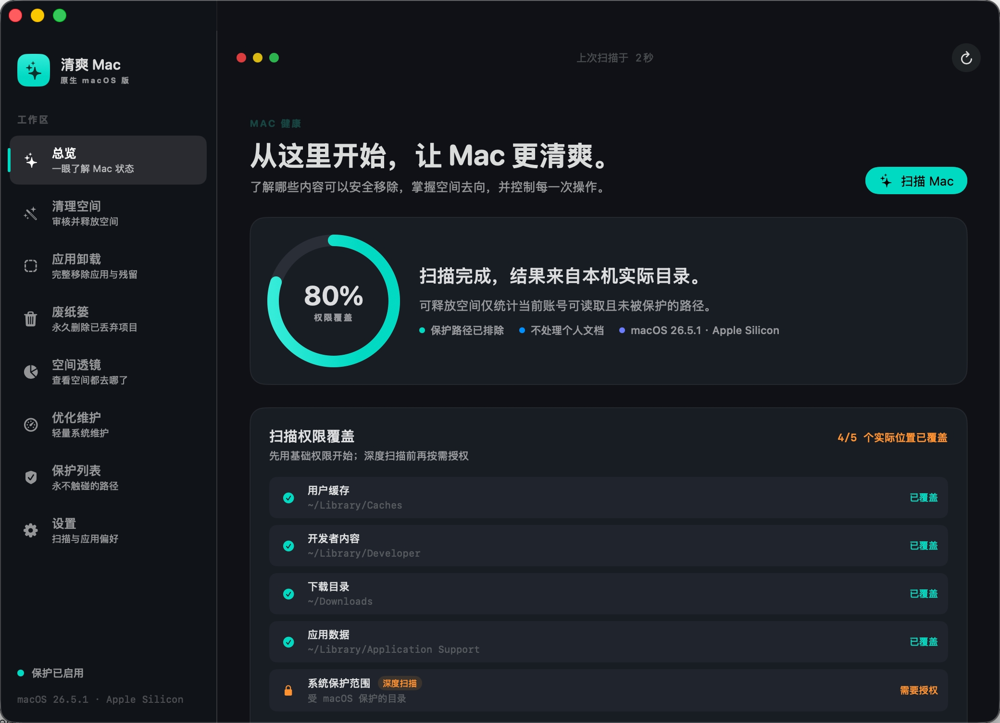
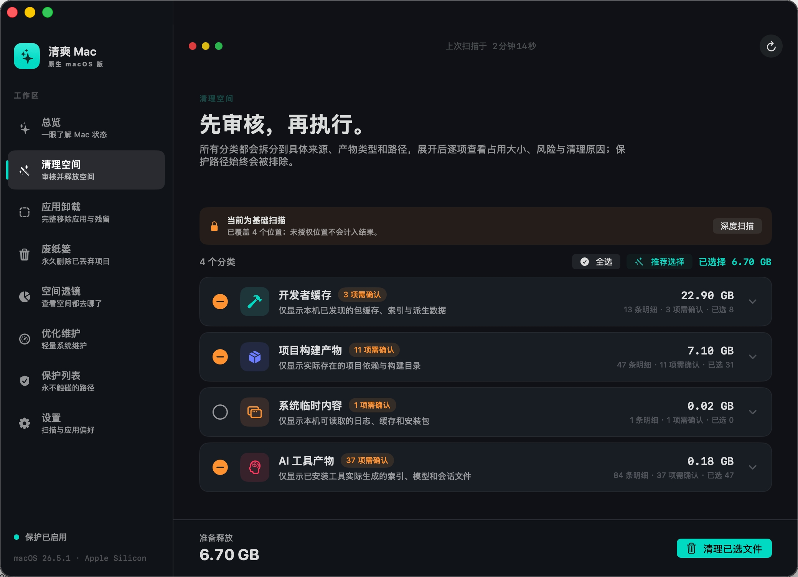
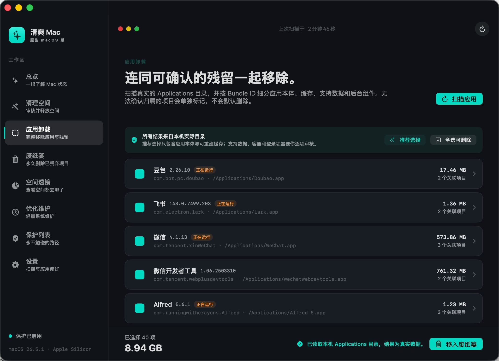
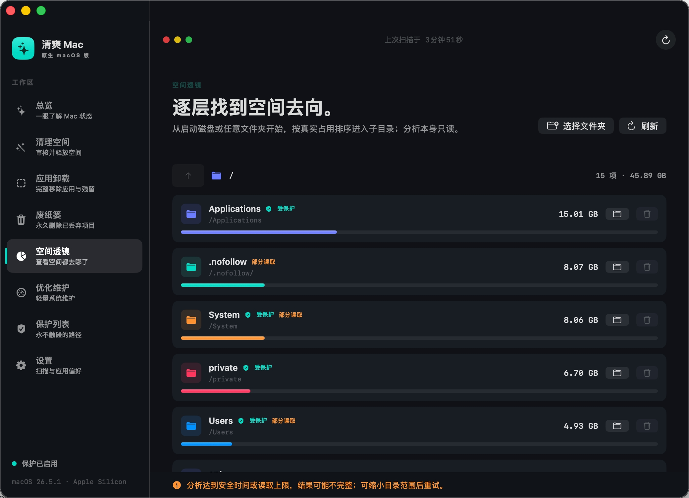

# 清爽 Mac

原生 macOS 清理与维护工具，使用 SwiftUI + AppKit 构建。所有扫描结果来自当前 Mac 的真实文件系统，不内置演示数据，不上传文件内容。

> 当前项目定位为个人使用版本，尚未接入自动更新、商业授权、云端同步或远程服务。

项目参考 [MacPaw/cleanmymac-cli](https://github.com/MacPaw/cleanmymac-cli) 的命令设计和功能边界；本项目是独立的原生 SwiftUI/AppKit 实现，不包含或复制上游源码。

## 功能

| 模块 | 说明 |
| --- | --- |
| 总览 | 查看磁盘、内存、权限覆盖和可释放空间 |
| 清理空间 | 按来源、产物类型和具体路径审核缓存、日志及构建产物 |
| 应用卸载 | 读取 `/Applications` 与 `~/Applications`，按 Bundle ID 识别应用残留 |
| 空间透镜 | 从启动磁盘或用户选择的目录逐层分析真实占用 |
| 废纸篓 | 查看已移入废纸篓的项目，并在明确确认后永久删除 |
| 优化维护 | 展示真实系统指标，并在本机存在对应 CLI 时调用受支持的维护命令 |
| 保护列表 | 配置永不触碰的路径 |

## 界面预览

以下截图来自应用实际运行界面，完整图片保存在 [`docs/screenshots/`](docs/screenshots/)：

<p align="center">
  
  
</p>
<p align="center"><sub>总览 · 清理空间</sub></p>
<p align="center">
  
  
</p>
<p align="center"><sub>应用卸载 · 空间透镜</sub></p>

截图使用统一窗口尺寸，并已注意遮挡个人文件名、路径和其他隐私信息。

### 应用卸载的安全边界

- 每个候选项都会显示真实路径、大小、分类、归属依据和风险级别。
- 推荐选择只包含应用本体和可重建缓存；支持数据、沙盒容器、网页数据和登录项需要人工审核。
- 系统应用、符号链接、读取不完整、资源身份无法复核或无法确认归属的项目默认禁止处理。
- 正在运行的应用不会被强制结束；请先退出应用再执行卸载。
- 执行操作会先将项目移入 macOS 废纸篓，并生成卸载审核报告，用户可以恢复。
- macOS 应用可能使用云端、外接磁盘、共享容器或自定义目录，因此不能承诺所有应用绝对零残留；界面会区分已确认项目与未处理边界。

## 技术栈

- Swift 5.9
- SwiftUI + AppKit
- macOS 13 或更高版本
- Apple Silicon 原生构建（也可按 SwiftPM 环境构建 Intel 版本）
- `rust-core` 是独立实验库，目前未链接到 Swift 主程序

## 开始使用

### 环境要求

- macOS 13+
- Xcode Command Line Tools（提供 `swift`）
- 可选：Rust 工具链，用于检查 `rust-core`

### 运行

```bash
swift run
```

### 测试

```bash
swift test
cd rust-core && cargo test
```

### 构建 macOS 应用包

```bash
./scripts/package-app.sh
```

默认使用本机临时签名，生成 `清爽 Mac.app`。如需固定本机签名证书：

```bash
SIGNING_IDENTITY="清爽 Mac 本机签名" ./scripts/package-app.sh
```

个人在自己的 Mac 上运行不需要 Apple Developer Program、Developer ID 或公证。对外分发前仍需配置正式签名、沙盒策略、隐私说明和公证流程。

## 权限与隐私

- 基础扫描优先使用当前用户目录和用户主动选择的目录。
- 深度扫描涉及受 macOS 保护的范围时，应用会显示具体权限覆盖状态，并引导到“系统设置 → 隐私与安全性 → 完全磁盘访问权限”。
- 未授权的位置不会伪造大小或文件结果。
- 应用不读取邮件、消息正文，也不上传扫描内容。
- 清理和卸载均使用可恢复的废纸篓流程，不执行 `rm -rf`。

## 性能设计

- 启动时不递归扫描整个磁盘。
- 扫描、分析、清理和卸载在低优先级后台任务中执行，并提供停止操作。
- 单次扫描、目录遍历和条目数量均有安全上限；读取不完整时禁止清理。
- 同一时间只允许一个文件系统任务运行，避免高 CPU 和磁盘争用。

## 项目结构

```text
Sources/CleanMyMac/
- AppModels.swift          # 导航、清理和权限模型
- AppViews.swift           # SwiftUI 页面与交互
- CleanMyMacApp.swift      # 应用状态、任务编排和系统集成
- CleanupSafety.swift      # 清理路径安全策略
- StorageAnalyzer.swift    # 空间分析
- UninstallModels.swift    # 卸载数据模型
- UninstallService.swift   # 应用扫描、残留识别和废纸篓处理
Tests/CleanMyMacTests/      # 路径、选择和卸载安全测试
rust-core/                  # 未接入主程序的 Rust 实验库
scripts/package-app.sh      # 构建、图标、签名和打包
```

## 上游项目说明

上游 CLI 当前不提供应用卸载命令；本项目的“应用卸载”是独立实现，不会假装调用不存在的 CLI 能力。除可选调用本机已安装的受支持维护命令外，核心扫描、审核和卸载流程均由本项目自行实现。

## 贡献与问题反馈

提交 Issue 时请附上：macOS 版本、芯片架构、复现步骤、相关日志和是否授予完全磁盘访问权限。请勿上传个人文件路径以外的敏感内容、密钥或完整系统报告。

## 许可证

当前仓库尚未声明开源许可证。未明确授权前，请不要将代码用于再分发或商业发行。
